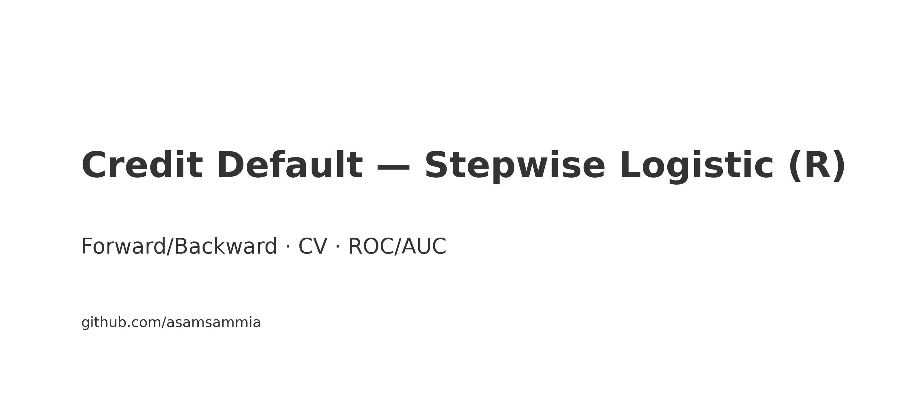

# Credit Default (UCI) — Stepwise Logistic (R)

    Final project: forward & backward stepwise logistic regression with 10‑fold CV, ROC/AUC, confusion matrix.

    ## Quickstart
    ```r
    # install
    pkgs <- c("optparse","readxl","pROC","boot","dplyr","jsonlite")
    to_install <- pkgs[!pkgs %in% rownames(installed.packages())]
    if (length(to_install)) install.packages(to_install, repos="https://cloud.r-project.org")

    # demo
    Rscript scripts/demo.R
    ```

    ## Scripts
    - `scripts/logit_stepwise_cv.R` — stepwise (AIC), CV, ROC/AUC, confusion
    - `scripts/demo.R` — synthetic demo so CI always runs green

    ---

    ## Results
    ### Results — Credit Default (Final)
- Test samples: **9000**
- ROC AUC: **0.716**
- Accuracy: **0.684**
- Precision (Positive=1): **0.373**
- Recall (Positive=1): **0.628**

Confusion Matrix (30% holdout):
|        | Pred 0 | Pred 1 |
|--------|--------|--------|
| **Actual 0** | 4902 | 2107 |
| **Actual 1** | 740 | 1251 |


---

## How to Cite
**APA (suggested):**  
Samih, A. (2025). *Credit Default — Stepwise Logistic (R)*. GitHub repository. https://github.com/asamsammia/credit-default-stepwise-R

**BibTeX:**
```bibtex
@software{Samih2025-credit-default-stepwise-R,
  author  = {Abdul Samih},
  title   = {Credit Default — Stepwise Logistic (R)},
  year    = {2025},
  url     = {https://github.com/asamsammia/credit-default-stepwise-R}
}
```

## Limitations
- **Class imbalance & thresholding:** Precision/recall trade‑off depends on the 0.5 threshold; tune per use‑case.
- **Stepwise AIC instability:** Forward/backward selection can overfit or vary across folds.
- **No cost matrix:** Equal cost for FP/FN; adjust threshold or use cost‑sensitive metrics if needed.
- **Feature scale & collinearity:** Logistic assumes linear log‑odds; correlated features can distort inference.
- **Generalization:** Metrics are dataset‑specific; validate on external data where possible.